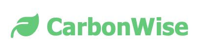
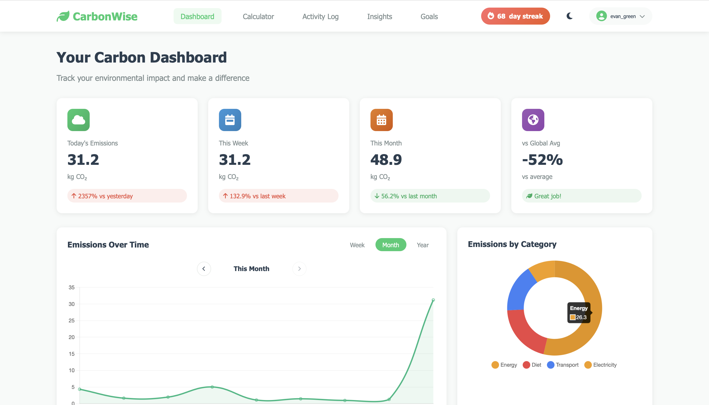
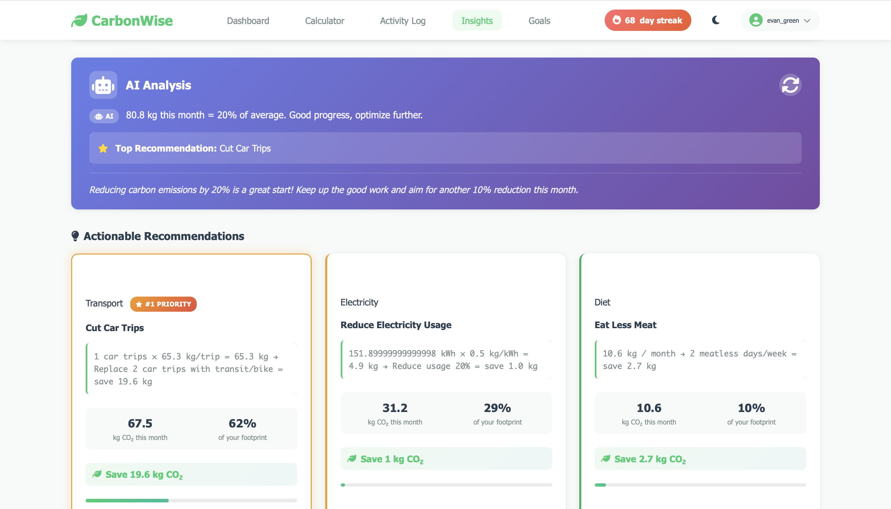
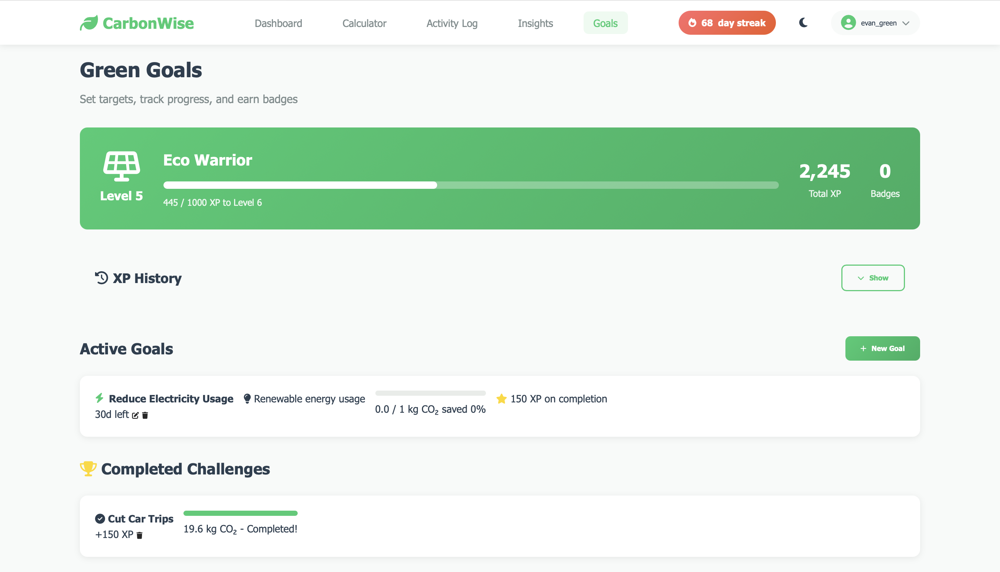

<p align="center">
  
</p>

<h1 align="center">CarbonWise</h1>

<p align="center">
  <strong>Your Personal Carbon Footprint Tracker with AI-Powered Insights</strong>
</p>

<p align="center">
  Track daily activities • Get AI recommendations • Set goals • Compete on leaderboards
</p>

<p align="center">
  
  
  
  
</p>

---

## 📸 Screenshots

<p align="center">
  
</p>
<p align="center"><em>Dashboard — Live stats, charts, and leaderboard</em></p>

<p align="center">
  
</p>
<p align="center"><em>Insights — AI-powered recommendations</em></p>

<p align="center">
  
</p>
<p align="center"><em>Goals — Track your sustainability targets</em></p>

---

## ✨ Features

### 🏠 Dashboard
- **Real-time statistics** — Today's emissions, weekly average, monthly total
- **Interactive charts** — Week/month/year views with date navigation
- **Category breakdown** — Pie chart showing emissions by type
- **Live leaderboard** — Compare your footprint with other users

### 📊 Activity Tracking
Log activities across **5 categories**:
| Category | Examples |
|----------|----------|
| 🚗 Transport | Car trips, flights, public transit, cycling |
| ⚡ Electricity | Daily usage in kWh |
| 🔥 Heating | Gas, oil, electric heating |
| 🍔 Diet | Meat, vegetarian, vegan meals |
| 🗑️ Waste | Recycling, composting, landfill |

### 🧮 Carbon Calculator
Answer 8 lifestyle questions to estimate your **annual carbon footprint**:
- Transportation habits
- Home energy usage
- Dietary preferences
- Shopping & waste patterns
- Personalized comparison to national averages

### 🤖 AI-Powered Insights
**Two-tier intelligence system:**

1. **Ollama LLM** (Local AI)
   - Executive summaries of your carbon data
   - Conversational recommendations
   - Trend analysis in natural language

2. **Python ML Service** (scikit-learn)
   - **User Clustering** — K-Means classification into lifestyle profiles
   - **Emission Prediction** — Random Forest forecasting (daily/weekly/monthly)
   - **Anomaly Detection** — Isolation Forest to spot unusual patterns
   - **Smart Recommendations** — Based on similar users' successful strategies

### 🎯 Goal Setting
- Create custom sustainability goals
- Track progress with visual indicators
- Earn XP bonuses for completing goals

### 🏆 Gamification
| Feature | Details |
|---------|---------|
| **XP System** | Earn points for logging activities and completing goals |
| **15 Levels** | Seedling → Sprout → Green Thumb → ... → Eco Master |
| **Daily Streaks** | Maintain consecutive days of logging |
| **Leaderboard** | Compete with other users |
| **XP History** | Track your progression over time |

### 📋 Detailed Reports
Generate comprehensive PDF-ready reports with:
- Executive summary (AI-generated)
- Category breakdowns with charts
- Trend analysis
- Personalized recommendations
- Date range filtering

### 🎨 User Experience
- **Dark/Light Theme** — Toggle with one click
- **Responsive Design** — Works on desktop and mobile
- **Profile Management** — Edit username/email with validation
- **Session Persistence** — JWT-based authentication

---

## 🚀 Quick Start

### Prerequisites
- Node.js 16+
- npm
- Python 3.8+ (optional, for ML service)
- Ollama (optional, for AI insights)

### Installation

```bash
# Clone the repository
git clone https://github.com/AbhiramK01/CarbonWise.git
cd CarbonWise

# Install Node.js dependencies
npm install

# Create environment file
cat > .env << EOF
PORT=3000
JWT_SECRET=your_super_secret_key_change_this_in_production
OLLAMA_URL=http://localhost:11434
OLLAMA_MODEL=llama3.1:8b
EOF

# Start the server
npm start
```

Open http://localhost:3000 in your browser.

### Seed Demo Data (Recommended)

```bash
node seed-users.js
```

This creates **5 demo users** with 60+ days of activity history:

| User | Email | Carbon Profile |
|------|-------|----------------|
| 🚗 Alex | `alex.commuter@demo.com` | Heavy commuter — High transport |
| 🍔 Bella | `bella.foodie@demo.com` | Food lover — High diet emissions |
| 🏠 Charlie | `charlie.homebody@demo.com` | Home-focused — High energy usage |
| ⚖️ Diana | `diana.average@demo.com` | Balanced lifestyle |
| 🌿 Evan | `evan.green@demo.com` | Eco-conscious — Low footprint |

> **Password:** `demo123` for all accounts

---

## 🤖 AI Setup (Optional)

### Ollama (Recommended)
For AI-powered insights and natural language analysis:

```bash
# macOS
brew install ollama

# Linux
curl -fsSL https://ollama.ai/install.sh | sh

# Windows — Download from https://ollama.ai/download
```

```bash
# Pull the model (4.7GB download)
ollama pull llama3.1:8b

# Start the server
ollama serve
```

> **Note:** CarbonWise works without Ollama — falls back to rule-based insights.

### Python ML Service (Advanced)
For clustering, predictions, and anomaly detection:

```bash
cd ml-service

# Install dependencies
pip install -r requirements.txt

# Generate training data
python generate_data.py

# Train models
python train_models.py

# Start ML service (runs on port 5001)
python app.py
```

See [ml-service/README.md](ml-service/README.md) for detailed documentation.

---

## 🛠 Tech Stack

### Backend
| Technology | Purpose |
|------------|---------|
| **Node.js + Express** | REST API server |
| **SQLite (sql.js)** | Embedded database (no native modules) |
| **JWT** | Stateless authentication |
| **bcryptjs** | Password hashing |

### Frontend
| Technology | Purpose |
|------------|---------|
| **Vanilla JavaScript** | Single-page application |
| **Chart.js** | Interactive data visualizations |
| **Font Awesome 6** | Icons |
| **CSS3** | Custom styling with dark/light themes |

### AI/ML
| Technology | Purpose |
|------------|---------|
| **Ollama** | Local LLM for natural language insights |
| **Flask** | Python ML microservice |
| **scikit-learn** | K-Means, Random Forest, Isolation Forest |

---

## 📁 Project Structure

```
CarbonWise/
├── server.js              # Express entry point
├── package.json           # Node.js dependencies
├── seed-users.js          # Demo data generator
│
├── database/
│   ├── db.js              # sql.js wrapper & schema
│   └── carbonwise.db      # SQLite database (auto-created)
│
├── routes/
│   ├── auth.js            # Register, login, profile
│   ├── activities.js      # CRUD for carbon activities
│   ├── goals.js           # Goal management
│   ├── insights.js        # AI insights & reports
│   ├── stats.js           # Dashboard statistics
│   └── leaderboard.js     # Rankings
│
├── utils/
│   ├── gamification.js    # XP, levels, streaks
│   ├── insights-engine.js # Rule-based recommendations
│   ├── ollama.js          # Ollama LLM client
│   └── ml-client.js       # Python ML service client
│
├── middleware/
│   └── auth.js            # JWT verification
│
├── public/
│   ├── index.html         # SPA frontend
│   ├── app.js             # Frontend logic (~3600 lines)
│   └── styles.css         # Styles (~2700 lines)
│
└── ml-service/            # Python ML microservice
    ├── app.py             # Flask API
    ├── train_models.py    # Model training
    ├── generate_data.py   # Synthetic data generator
    └── requirements.txt   # Python dependencies
```

---

## 🔌 API Reference

| Method | Endpoint | Description |
|--------|----------|-------------|
| `POST` | `/api/auth/register` | Create account |
| `POST` | `/api/auth/login` | Get JWT token |
| `GET` | `/api/auth/me` | Get current user |
| `PUT` | `/api/auth/me` | Update profile |
| `GET` | `/api/activities` | List activities |
| `POST` | `/api/activities` | Log new activity |
| `DELETE` | `/api/activities/:id` | Delete activity (deducts XP) |
| `GET` | `/api/goals` | List goals |
| `POST` | `/api/goals` | Create goal |
| `PUT` | `/api/goals/:id/progress` | Update progress |
| `GET` | `/api/insights` | Get AI recommendations |
| `GET` | `/api/insights/report/detailed` | Generate full report |
| `GET` | `/api/stats/dashboard` | Dashboard stats |
| `GET` | `/api/stats/charts` | Chart data |
| `GET` | `/api/leaderboard` | User rankings |

📄 **Full API documentation:** [SPECIFICATION.md](SPECIFICATION.md)

---

## ⚙️ Configuration

### Environment Variables

| Variable | Default | Description |
|----------|---------|-------------|
| `PORT` | `3000` | Server port |
| `JWT_SECRET` | — | **Required.** Secret for JWT signing |
| `OLLAMA_URL` | `http://localhost:11434` | Ollama server URL |
| `OLLAMA_MODEL` | `llama3.1:8b` | LLM model name |
| `OLLAMA_TIMEOUT` | `60000` | Request timeout (ms) |
| `ML_SERVICE_URL` | `http://localhost:5001` | Python ML service URL |

---

## 📚 Documentation

| Document | Description |
|----------|-------------|
| [SPECIFICATION.md](SPECIFICATION.md) | Full technical & feature specification |
| [docs/STARTUP-GUIDE.md](docs/STARTUP-GUIDE.md) | Step-by-step setup guide for all platforms |
| [docs/ML-LLM-ARCHITECTURE.md](docs/ML-LLM-ARCHITECTURE.md) | Hybrid ML + LLM architecture details |
| [ml-service/README.md](ml-service/README.md) | Python ML microservice documentation |

---

## 🤝 Contributing

1. Fork the repository
2. Create a feature branch: `git checkout -b feature/amazing-feature`
3. Commit changes: `git commit -m 'Add amazing feature'`
4. Push to branch: `git push origin feature/amazing-feature`
5. Open a Pull Request

---

## 📄 License

This project is licensed under the **ISC License**.

---

## 👤 Author

**Abhiram K**

- GitHub: [@AbhiramK01](https://github.com/AbhiramK01)

---

<p align="center">
  Made with 💚 for a sustainable future
</p>
